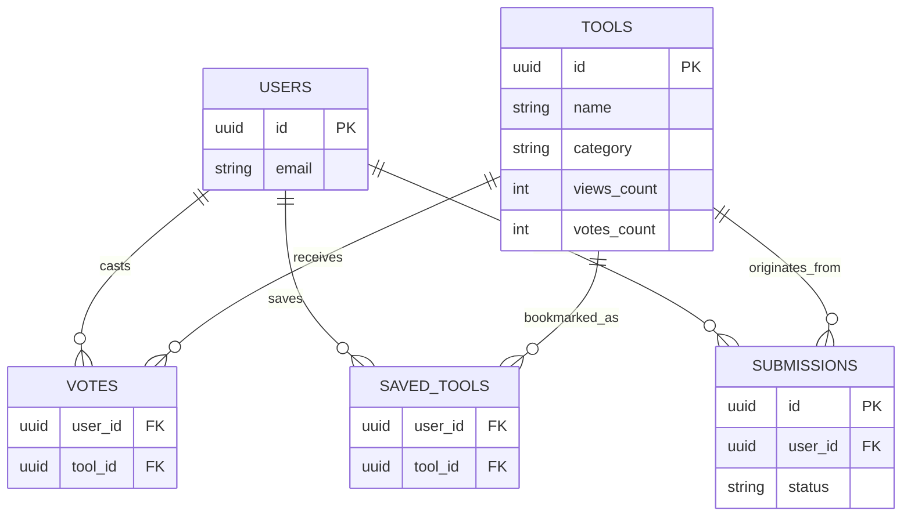

# AI-DEX

[](#)
[](#)
[](#)
[](#)
[](#)

A technical showcase of a modern, full-stack Next.js application built for discovering, organizing, and interacting with a curated directory of tools. Designed to demonstrate scalable frontend architecture, secure authentication, and robust database management.

---

## Live Demo
*(Placeholder: Insert link to deployed application here)*

---

## Screenshots

### Homepage
*(Placeholder: Add homepage screenshot here)*

### Search & Discovery
*(Placeholder: Add search and filtering screenshot here)*

### Tool Details
*(Placeholder: Add tool detail modal screenshot here)*

### Saved Tools
*(Placeholder: Add saved tools collection screenshot here)*

### Submit Tool
*(Placeholder: Add tool submission form screenshot here)*

---

## Technical Highlights

- **Next.js App Router**: Utilizes React Server Components (RSC) for initial fast data fetching and Client Components for rich interactivity.
- **TypeScript**: End-to-end type safety protecting data models, API payloads, and component props.
- **Supabase Authentication**: Integrated secure authentication with session management and route protection.
- **PostgreSQL**: Relational database handling complex queries, aggregation, and foreign-key constraints.
- **Voting System**: Real-time optimistic UI updates for tool upvoting, preventing layout shifts and ensuring perceived performance.
- **Saved Tools System**: Authorized users can persist tools to their personal collections for later access.
- **Search and Filtering**: Client-side state synchronization with URL parameters (`/?search=keyword`) for shareable, debounced search queries.
- **Responsive Design**: Mobile-first Tailwind CSS implementation prioritizing accessibility and fluid layout adjustments.

---

## Database Architecture

The backend relies on a strictly-typed PostgreSQL schema managed via Supabase. Key entity relationships include:



---

## System Architecture

```text
User Request
    ↓
Next.js Frontend (React Server Components + Client Hooks)
    ↓
Supabase Database Client & Auth
    ├ Authentication (Session Management)
    ├ PostgreSQL Database (Tools, Votes, Saves, Profiles)
    └ Storage (Optional asset hosting)
```

---

## Challenges Solved

- **State Synchronization**: Maintained UI consistency between URL search parameters and client-side filtering without redundant component re-renders.
- **Optimistic UI Updates**: Designed custom React hooks (`use-vote`, `use-save`) that immediately reflect user actions locally while securely verifying the request against the database in the background.
- **Layout Shift Prevention**: Engineered exact dimensions for skeleton loading states (e.g., `DashboardSkeleton`) to flawlessly match the resolved UI, ensuring a jank-free user experience.
- **Secure Data Access**: Leveraged Supabase Row Level Security (RLS) policies to ensure users can only modify their own votes and saved tool collections.

---

## Deployment

### Vercel Deployment
For production hosting, deploying to Vercel is highly recommended to leverage native Next.js optimizations.

1. Push your code to a GitHub repository.
2. Import the project in Vercel.
3. Add the required environment variables (see below) in the Vercel dashboard.
4. Deploy.

---

## Quick Start

### 1. Clone the repository
```bash
git clone <repo-url>
cd aidex-app
```

### 2. Install dependencies
```bash
npm install
```

### 3. Configure environment variables
```bash
cp .env.example .env.local
```

---

## Supabase Setup

Run the SQL files in `supabase_scripts/` in the Supabase SQL editor in this order:
1. `supabase-schema.sql`
2. `setup-auth-rate-limits.sql`

---

## Environment Variables

| Variable | Description |
| --- | --- |
| `NEXT_PUBLIC_SUPABASE_URL` | Your Supabase project URL |
| `NEXT_PUBLIC_SUPABASE_ANON_KEY` | Supabase anonymous / public API key |
| `SUPABASE_SERVICE_ROLE_KEY` | Supabase service-role key (server-side only, **never** expose to the client) |
| `NEXT_PUBLIC_SITE_URL` | Public site URL, e.g. `http://localhost:3000` |
| `RESEND_API_KEY` | Resend API key for transactional emails |
| `EMAIL_FROM` | Verified sender address, e.g. `AIDex <noreply@yourdomain.com>` |

---

## Development

```bash
npm run dev
```

Open [http://localhost:3000](http://localhost:3000) in your browser.

---

## Testing

```bash
npm test           # single run
npm run test:watch # watch mode
```

---

## Production Deployment

```bash
npm run build
npm start
```

---

## License

This project is provided for educational and portfolio purposes.
